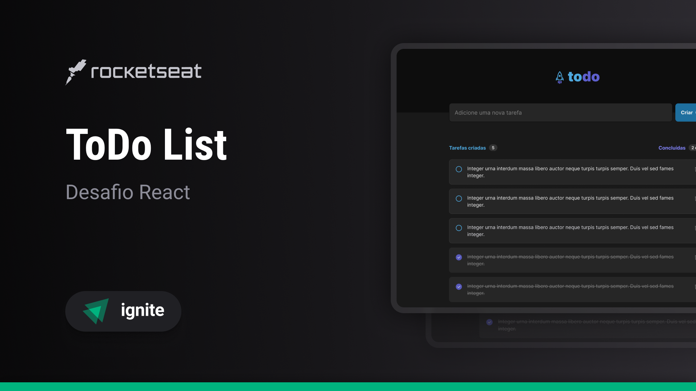

# 📝 ToDo List

Este repositório contém o código fonte e os arquivos relacionados ao curso "01 Fundamentos ReactJS com TypeScript". O curso tem como objetivo fornecer uma introdução sólida aos fundamentos do ReactJS usando TypeScript.

## 📂 Estrutura do Repositório

O repositório está estruturado da seguinte forma:
```
desafio-todo-rockectseat-reactjs-ts/
|-- src/
	| |-- assets/
		| | |-- Image1.png
		| | |-- Image2.svg
		| | |-- ...
	| |-- components/
		| | |-- Component1.tsx
		| | |-- Component1.module.css
		| | |-- Component2.tsx
		| | |-- Component2.module.css
		| | |-- ...
	| |-- App.tsx
|-- public/
	| |-- index.html
|-- ...
|-- README.md
|-- ...
```

- 📁 **src**: Contém os arquivos TypeScript do projeto, organizados em pastas como `components/` para componentes reutilizáveis e `pages/` para as páginas principais do aplicativo.
- 🌐 **public**: Contém o arquivo `index.html`, que serve como o ponto de entrada da aplicação React.

## 🚀 Como Iniciar o Projeto
Necessita de `Node.js v20+` para rodar.

Clone este repositório para o seu ambiente local:
```
git clone https://github.com/Wellington-Henrique/desafio-todo-rockectseat-reactjs-ts/tree/master
````

Instale as dependências do projeto:
```
npm i
```

Inicie a aplicação:
```
npm run dev
```

Isso iniciará a aplicação em modo de desenvolvimento. Abra http://localhost:5173/ no seu navegador para visualizar a aplicação.
	
## 🛠 Tecnologias Utilizadas
- 🚀 **[ReactJS](https://reactjs.org/):** Uma biblioteca JavaScript para construção de interfaces de usuário.
- 🔍 **[TypeScript](https://www.typescriptlang.org/):** Uma linguagem superset JavaScript que adiciona tipagem estática opcional.
- ⚡ **[Vite](https://vitejs.dev/):** Um construtor de aplicações JavaScript rápido e flexível.
- 💅 **Módulos de CSS:** Os módulos de CSS no projeto são unidades organizacionais que dividem o código estilístico em partes específicas, focando em componentes individuais.
- 📱 **Responsividade:** A responsividade no projeto é assegurada por meio de um layout fluído, uso de media queries para ajustar estilos conforme o tamanho da tela.

## Logo do Projeto


Contribuição

Se você encontrar problemas, bugs ou tiver sugestões para melhorar este projeto, sinta-se à vontade para abrir uma issue ou enviar um pull request.

## 📜 Licença
MIT